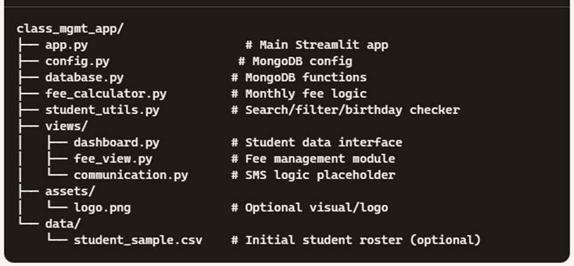

# 🎓 Class Management System

A modular and scalable web app built with **Streamlit**, **MongoDB**, and **Python** to assist Class Incharges in efficiently managing student information, fee records, birthday calendars, and parent communications.

Designed specifically for academic sessions (e.g., 2025–2026), this system provides a streamlined interface to manage up to 40+ students per section.

---

## 🚀 Features

### 📋 Student Dashboard
- Filter by name, gender, and DOB
- View birthday highlights and age calculations
- Duplicate contact detection and sibling grouping

### 📅 Birthday Calendar
- Month-wise student birthdays
- Celebration reminders and sorting by date

### 📊 Age Analyzer
- Auto-calculates student ages as of today
- Highlights students underage or overage for Class 10

### 📱 Contact Validator
- Detect repeated or missing phone numbers
- Optional export for verification

### 👨‍👩‍👧‍👦 Sibling Tracker
- Groups students by parent names to identify siblings
- Flags overlapping guardianship cases

### 💰 Fee Management
- Tracks monthly fees (April–March session)
- Supports zero-fee cases for fatherless students
- Displays paid/unpaid status per student

### 🛠️ Communication Module *(Coming Soon)*
- Birthday wishes via SMS/email
- Fee reminders and attendance alerts

---

## 🏗️ Project Structure

class_mgmt_app/ ├── app.py ├── config.py ├── database.py ├── fee_calculator.py ├── student_utils.py ├── views/ │ ├── dashboard.py │ ├── fee_view.py │ └── communication.py ├── assets/ │ └── logo.png ├── data/ │ └── student_sample.csv

---


## ⚙️ Technologies Used

| Module       | Tech Stack        |
|--------------|-------------------|
| UI           | Streamlit         |
| Backend      | Python             |
| Database     | MongoDB (local or Atlas) |
| Messaging    | Twilio API *(future)* |
| IDE          | Visual Studio Code |

---

## 💾 Setup Instructions

### 1. 🧱 Initialize Project
Run the provided setup script in PowerShell (trusting local execution):
```ps
.\classmanagement_setup.bat

### 2. 📦 Install Dependencies
Create a virtual environment and install packages:
python -m venv venv
venv\Scripts\activate
pip install streamlit pymongo pandas

### 3. 🔗 MongoDB Config
Update config.py with your MongoDB URI:

MONGO_URI = "mongodb+srv://<username>:<password>@cluster.mongodb.net/class_mgmt"

4. 🏁 Launch App
streamlit run app.py

📅 Fee Structure (Fatherless/Non-Fatherless)
Category	Fatherless	Non-Fatherless
Admission Fee	₹0	₹0
Tuition Fee	₹0	₹0
Absentee Fine	₹0	₹0
Late Fee Fine	₹0	₹0
Amalgamated Fund	₹0	₹20
PTA Fund	₹0	₹15
Sports Fund	₹0	₹15
Other	₹0	₹5
Continuation Fee	₹0	₹200
Total Monthly Fee	₹0	₹255
📌 Future Enhancements
Admin login and role-based access

PDF receipt generation

Editable fee/fine adjustments

Attendance integration

Excel export of student summaries

👨‍🏫 Author
Jagdev Singh Dosanjh Computer Science Faculty | Developer of SmartSchoolAI tools Passionate about educational equity, modular tech systems, and scalable learning platforms.

📜 License
This project is for educational and non-commercial use. Reach out if you'd like to collaborate or extend it further!


---

If you'd like me to generate this inside the project folder automatically, I can give you a script. Or, we can move on to coding the `app.py` core interface. What next, Captain? 💻✨